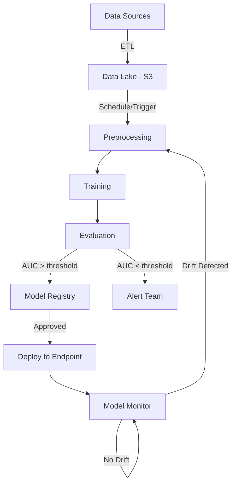

# Model Retraining, Data Strategy & Production Architectures

> Your biggest doubt answered: What happens when model accuracy drops?
> How does retraining work? Old data vs new data? What triggers it?
> Plus 3 real-world production architectures used in industry.

---

## Table of Contents

1. [The Retraining Problem (Your Question Answered)](#1-the-retraining-problem)
2. [Data Strategy: Old Data vs New Data](#2-data-strategy)
3. [Retraining Triggers & Mechanisms](#3-retraining-triggers)
4. [Architecture 1: Scheduled Batch Retraining (Most Common)](#4-architecture-1)
5. [Architecture 2: Event-Driven Retraining (Modern)](#5-architecture-2)
6. [Architecture 3: Continuous Training with Feature Store (Enterprise)](#6-architecture-3)
7. [How Airflow Fits In](#7-how-airflow-fits-in)
8. [Step-by-Step: What Happens When Accuracy Drops](#8-accuracy-drops)
9. [Choosing the Right Architecture](#9-choosing)

---

## 1. The Retraining Problem (Your Question Answered)

### The Lifecycle You're Asking About

```
┌─────────────────────────────────────────────────────────────────────────┐
│                                                                           │
│   DATA SOURCES          MODEL IN PRODUCTION           MONITORING          │
│   ───────────          ──────────────────           ──────────           │
│                                                                           │
│   ┌─────────┐         ┌─────────────────┐         ┌──────────────┐      │
│   │   DB    │         │                 │         │              │      │
│   │  (new   │────────▶│  ML Model v1    │────────▶│  Monitor     │      │
│   │  data   │         │  (deployed)     │         │  Accuracy    │      │
│   │  daily) │         │                 │         │              │      │
│   └─────────┘         └─────────────────┘         └──────┬───────┘      │
│                                                           │              │
│                                                           │              │
│                              ┌────────────────────────────┘              │
│                              │                                           │
│                              ▼                                           │
│                     ┌─────────────────┐                                  │
│                     │  ACCURACY       │                                  │
│                     │  DROPPED!       │                                  │
│                     │  AUC: 0.85→0.72 │                                  │
│                     └────────┬────────┘                                  │
│                              │                                           │
│                              ▼                                           │
│                     ┌─────────────────┐         ┌─────────────────┐     │
│                     │  TRIGGER        │────────▶│  RETRAIN        │     │
│                     │  (Airflow/      │         │  Pipeline       │     │
│                     │   EventBridge/  │         │  (auto or       │     │
│                     │   Manual)       │         │   manual)       │     │
│                     └─────────────────┘         └────────┬────────┘     │
│                                                          │              │
│                                                          ▼              │
│                                                 ┌─────────────────┐     │
│                                                 │  ML Model v2    │     │
│                                                 │  (new version)  │     │
│                                                 │  Deployed!      │     │
│                                                 └─────────────────┘     │
│                                                                          │
└─────────────────────────────────────────────────────────────────────────┘
```

### The Short Answer to Your Questions

**Q: How is the model retrained when accuracy drops?**

A: An automated pipeline (Airflow, SageMaker Pipelines, or Step Functions) detects the drop and kicks off a retraining job. The pipeline:
1. Pulls fresh data from the DB/data lake
2. Preprocesses it
3. Trains a new model
4. Evaluates it against the old model
5. If better → deploys it (replaces old model)
6. If worse → alerts the team (something fundamental changed)

**Q: Does it retrain on old data or new data?**

A: **Both — but with a strategy.** The most common approaches:

| Strategy | What It Means | When to Use |
|----------|--------------|-------------|
| **Full retrain** | Train on ALL data (old + new) | Most common, safest |
| **Sliding window** | Train on last N months only | When old data becomes irrelevant |
| **Incremental/Online** | Update model with only new data | Real-time systems, streaming |
| **Weighted** | Recent data weighted more heavily | Gradual concept drift |

---

## 2. Data Strategy: Old Data vs New Data

### The Data Flow in Production

```
┌──────────────────────────────────────────────────────────────────┐
│                        DATA TIMELINE                               │
├──────────────────────────────────────────────────────────────────┤
│                                                                    │
│  Jan 2024        Jun 2024        Jan 2025        Jun 2025         │
│  ─────────────────────────────────────────────────────────────    │
│  │ Original      │ New data      │ More data     │ Latest        │
│  │ training      │ arrives       │ arrives       │ data          │
│  │ data          │ monthly       │ monthly       │               │
│  ─────────────────────────────────────────────────────────────    │
│                                                                    │
│  Model v1 trained here ──┐                                        │
│                           │                                        │
│  6 months later: accuracy drops because customer behavior changed  │
│                                                                    │
│  OPTION A: Full Retrain (ALL data Jan 2024 → Jun 2025)            │
│  ════════════════════════════════════════════════                  │
│  Pros: Most data, most robust                                     │
│  Cons: Old patterns may not be relevant anymore                   │
│                                                                    │
│  OPTION B: Sliding Window (Last 12 months only)                   │
│  ═══════════════════════════════════════════════                   │
│  Pros: Focuses on recent patterns                                 │
│  Cons: Less data, may miss long-term patterns                     │
│                                                                    │
│  OPTION C: Weighted (All data, but recent weighted 3x)            │
│  ═════════════════════════════════════════════════════             │
│  Pros: Best of both worlds                                        │
│  Cons: More complex to implement                                  │
│                                                                    │
└──────────────────────────────────────────────────────────────────┘
```

### Which Strategy to Use?

| Scenario | Best Strategy | Why |
|----------|--------------|-----|
| Customer behavior changes slowly | Full retrain | More data = better |
| Seasonal business (fashion, retail) | Sliding window (1 year) | Last year's season is most relevant |
| Fast-changing environment (social media, fraud) | Sliding window (3-6 months) | Old patterns are obsolete |
| Gradual drift | Weighted recent data | Smooth transition |
| Sudden event (COVID, market crash) | Drop pre-event data | Old world no longer applies |

### How New Data Gets Into the Pipeline

```
┌─────────────┐     ┌──────────────┐     ┌──────────────┐     ┌──────────┐
│ Application │     │   Database   │     │  Data Lake   │     │ Training │
│ (users      │────▶│  (PostgreSQL │────▶│  (S3)        │────▶│ Pipeline │
│  interact)  │     │   DynamoDB)  │     │              │     │          │
└─────────────┘     └──────────────┘     └──────────────┘     └──────────┘
                           │                     │
                     Daily ETL job          Glue/Spark job
                     (extract new           (transform &
                      records)               store as
                                            Parquet)

The pipeline ALWAYS reads from the Data Lake (S3), never directly from the DB.
This ensures:
  - DB is not overloaded by training queries
  - Data is versioned and reproducible
  - Preprocessing is consistent
```

---

## 3. Retraining Triggers & Mechanisms

### What Triggers Retraining?

```
┌─────────────────────────────────────────────────────────────┐
│                    RETRAINING TRIGGERS                        │
├─────────────────────────────────────────────────────────────┤
│                                                               │
│  ┌─────────────────┐                                         │
│  │  1. SCHEDULED   │  "Retrain every Sunday at 2 AM"         │
│  │     (Cron)      │  Most common. Simple. Predictable.      │
│  └─────────────────┘                                         │
│                                                               │
│  ┌─────────────────┐                                         │
│  │  2. DRIFT       │  "Retrain when AUC drops below 0.78"    │
│  │     DETECTED    │  Smart. Retrains only when needed.      │
│  └─────────────────┘                                         │
│                                                               │
│  ┌─────────────────┐                                         │
│  │  3. NEW DATA    │  "Retrain when 10K new labeled          │
│  │     VOLUME      │   records arrive"                       │
│  └─────────────────┘                                         │
│                                                               │
│  ┌─────────────────┐                                         │
│  │  4. MANUAL      │  "Data scientist clicks retrain"        │
│  │     TRIGGER     │  For experiments, hotfixes.             │
│  └─────────────────┘                                         │
│                                                               │
│  ┌─────────────────┐                                         │
│  │  5. CODE CHANGE │  "New feature engineering merged"        │
│  │     (CI/CD)     │  Retrain with improved pipeline.        │
│  └─────────────────┘                                         │
│                                                               │
└─────────────────────────────────────────────────────────────┘
```

### How Each Trigger Works Technically

| Trigger | Technology | How |
|---------|-----------|-----|
| Scheduled | Airflow / EventBridge / Cron | Timer fires → starts pipeline |
| Drift detected | Model Monitor → CloudWatch Alarm → Lambda | Metric crosses threshold → Lambda starts pipeline |
| New data volume | S3 event / Glue job completion → Lambda | Enough new data accumulated → starts pipeline |
| Manual | Console button / CLI / API call | Human decides → starts pipeline |
| Code change | GitHub Actions / CodePipeline | PR merged → CI/CD starts pipeline |

### The Retraining Pipeline (What Actually Runs)

```
TRIGGER fires
    │
    ▼
┌─────────────────────────────────────────────────────────────┐
│                    RETRAINING PIPELINE                        │
├─────────────────────────────────────────────────────────────┤
│                                                               │
│  Step 1: PULL DATA                                           │
│  ─────────────────                                           │
│  Query data lake for training window                         │
│  e.g., "All records from last 12 months"                    │
│  Output: s3://bucket/data/retrain/2025-06-15/               │
│                                                               │
│  Step 2: PREPROCESS                                          │
│  ─────────────────                                           │
│  Same preprocessing as original (consistency!)               │
│  Split into train/val/test                                   │
│                                                               │
│  Step 3: TRAIN NEW MODEL                                     │
│  ────────────────────────                                    │
│  Train with same (or tuned) hyperparameters                  │
│  Output: model_v2.tar.gz                                     │
│                                                               │
│  Step 4: EVALUATE                                            │
│  ────────────────                                            │
│  Compare new model vs current production model               │
│  On SAME test set (fair comparison)                          │
│                                                               │
│  Step 5: CHAMPION vs CHALLENGER                              │
│  ──────────────────────────────                              │
│  If new_model_auc > current_model_auc:                       │
│      → Register new model (v2)                               │
│      → Deploy (replace or A/B test)                          │
│  Else:                                                       │
│      → Alert team: "Retraining didn't help"                  │
│      → Investigate root cause                                │
│                                                               │
│  Step 6: DEPLOY (if passed)                                  │
│  ──────────────────────────                                  │
│  Option A: Direct replacement (swap endpoint)                │
│  Option B: Canary (10% traffic → new model)                  │
│  Option C: Shadow (both run, compare, then switch)           │
│                                                               │
└─────────────────────────────────────────────────────────────┘
```

---

## 4. Architecture 1: Scheduled Batch Retraining (Most Common)

### Who Uses This: 80% of companies (Netflix recommendations, bank credit scoring, retail demand forecasting)

### When to Use
- Model accuracy degrades slowly (weeks/months)
- New data arrives in batches (daily/weekly DB dumps)
- Predictions are consumed in batch (not real-time critical)
- Team is small, wants simplicity

### Architecture Diagram

```
┌─────────────────────────────────────────────────────────────────────────────┐
│                                                                               │
│          ARCHITECTURE 1: SCHEDULED BATCH RETRAINING                           │
│          ══════════════════════════════════════════                           │
│                                                                               │
│                                                                               │
│  ┌──────────┐    Nightly ETL    ┌──────────────┐                             │
│  │          │  ──────────────▶  │              │                             │
│  │  Source  │   (Glue/Spark)    │  Data Lake   │                             │
│  │  DB      │                   │  (S3)        │                             │
│  │          │                   │              │                             │
│  └──────────┘                   └──────┬───────┘                             │
│                                        │                                      │
│                                        │ Data ready                           │
│                                        ▼                                      │
│  ┌─────────────────────────────────────────────────────────────────┐         │
│  │                                                                   │         │
│  │   AIRFLOW DAG (runs every Sunday at 2 AM)                        │         │
│  │   ═══════════════════════════════════════                        │         │
│  │                                                                   │         │
│  │   ┌──────────┐   ┌──────────┐   ┌──────────┐   ┌──────────┐   │         │
│  │   │  Pull    │──▶│Preprocess│──▶│  Train   │──▶│ Evaluate │   │         │
│  │   │  Data    │   │          │   │          │   │          │   │         │
│  │   └──────────┘   └──────────┘   └──────────┘   └────┬─────┘   │         │
│  │                                                       │         │         │
│  │                                              ┌────────┴───────┐ │         │
│  │                                              │  AUC > 0.78?   │ │         │
│  │                                              └───┬────────┬───┘ │         │
│  │                                                  │        │     │         │
│  │                                              YES │        │ NO  │         │
│  │                                                  ▼        ▼     │         │
│  │                                           ┌─────────┐ ┌──────┐ │         │
│  │                                           │ Register│ │Alert │ │         │
│  │                                           │ & Deploy│ │ Team │ │         │
│  │                                           └─────────┘ └──────┘ │         │
│  │                                                                   │         │
│  └─────────────────────────────────────────────────────────────────┘         │
│                                                                               │
│                         │                                                     │
│                         ▼                                                     │
│              ┌─────────────────────┐        ┌──────────────────┐             │
│              │  SageMaker Endpoint │        │  Batch Transform │             │
│              │  (real-time)        │   OR   │  (nightly score) │             │
│              └─────────────────────┘        └──────────────────┘             │
│                                                                               │
│                         │                                                     │
│                         ▼                                                     │
│              ┌─────────────────────┐                                         │
│              │  Model Monitor      │──── Drift alert ──▶ Next retrain        │
│              │  (CloudWatch)       │                                          │
│              └─────────────────────┘                                         │
│                                                                               │
└─────────────────────────────────────────────────────────────────────────────┘
```

### Airflow DAG Code for This Architecture

```python
from airflow import DAG
from airflow.operators.python import PythonOperator, BranchPythonOperator
from airflow.providers.amazon.aws.operators.sagemaker import (
    SageMakerProcessingOperator,
    SageMakerTrainingOperator,
)
from airflow.providers.amazon.aws.sensors.s3 import S3KeySensor
from datetime import datetime, timedelta

default_args = {
    'owner': 'ml-team',
    'retries': 2,
    'retry_delay': timedelta(minutes=10),
    'email_on_failure': True,
    'email': ['ml-team@company.com']
}

with DAG(
    'weekly_model_retrain',
    default_args=default_args,
    schedule_interval='0 2 * * 0',  # Every Sunday 2 AM
    start_date=datetime(2025, 1, 1),
    catchup=False,
    tags=['ml', 'retraining']
) as dag:

    # Step 1: Check if new data is available
    check_data = S3KeySensor(
        task_id='check_new_data',
        bucket_name='my-data-lake',
        bucket_key='processed/{{ ds }}/*.parquet',
        timeout=3600,
        poke_interval=300
    )

    # Step 2: Run preprocessing
    preprocess = SageMakerProcessingOperator(
        task_id='preprocess_data',
        config={...}  # SageMaker Processing job config
    )

    # Step 3: Train new model
    train = SageMakerTrainingOperator(
        task_id='train_model',
        config={...}  # SageMaker Training job config
    )

    # Step 4: Evaluate and decide
    def evaluate_and_decide(**context):
        new_auc = get_new_model_metrics()
        current_auc = get_current_model_metrics()
        if new_auc > current_auc and new_auc > 0.78:
            return 'deploy_model'
        else:
            return 'alert_team'

    decide = BranchPythonOperator(
        task_id='evaluate_model',
        python_callable=evaluate_and_decide
    )

    # Step 5a: Deploy if better
    deploy = PythonOperator(
        task_id='deploy_model',
        python_callable=deploy_new_model
    )

    # Step 5b: Alert if not better
    alert = PythonOperator(
        task_id='alert_team',
        python_callable=send_alert
    )

    check_data >> preprocess >> train >> decide >> [deploy, alert]
```

### Pros & Cons

| Pros | Cons |
|------|------|
| Simple to understand and maintain | Model may be stale between retrains |
| Predictable costs (runs on schedule) | Doesn't react to sudden changes |
| Easy to debug (clear pipeline) | May retrain unnecessarily |
| Works for most use cases | Fixed schedule may not match data patterns |

---

## 5. Architecture 2: Event-Driven Retraining (Modern)

### Who Uses This: Fintech (fraud detection), E-commerce (recommendations), Ad-tech

### When to Use
- Model accuracy can degrade quickly (days)
- You have real-time monitoring in place
- Cost of stale model is high (lost revenue, missed fraud)
- You want to retrain ONLY when needed (cost-efficient)

### Architecture Diagram

```
┌─────────────────────────────────────────────────────────────────────────────┐
│                                                                               │
│          ARCHITECTURE 2: EVENT-DRIVEN RETRAINING                             │
│          ═══════════════════════════════════════                              │
│                                                                               │
│                                                                               │
│  ┌──────────┐         ┌─────────────────┐         ┌──────────────────┐      │
│  │  Users/  │────────▶│  ML Endpoint    │────────▶│  Predictions     │      │
│  │  App     │ request │  (Model v1)     │ response│  + Ground Truth  │      │
│  └──────────┘         └─────────────────┘         └────────┬─────────┘      │
│                                                             │                 │
│                                                             │ Logged to       │
│                                                             ▼                 │
│                                                    ┌─────────────────┐       │
│                                                    │  Model Monitor  │       │
│                                                    │  (SageMaker /   │       │
│                                                    │   Evidently AI) │       │
│                                                    └────────┬────────┘       │
│                                                             │                 │
│                                                    Checks every hour:         │
│                                                    - Data drift (PSI)         │
│                                                    - Prediction drift         │
│                                                    - Accuracy (if labels      │
│                                                      available)               │
│                                                             │                 │
│                                              ┌──────────────┴──────────────┐ │
│                                              │     DRIFT DETECTED?          │ │
│                                              │     PSI > 0.25 OR            │ │
│                                              │     AUC < 0.78              │ │
│                                              └──────┬──────────────┬───────┘ │
│                                                     │              │         │
│                                                 YES │              │ NO      │
│                                                     ▼              ▼         │
│                                              ┌────────────┐  ┌─────────┐    │
│                                              │ CloudWatch │  │ Do      │    │
│                                              │ Alarm      │  │ Nothing │    │
│                                              └─────┬──────┘  └─────────┘    │
│                                                    │                         │
│                                                    ▼                         │
│                                              ┌────────────┐                  │
│                                              │ EventBridge│                  │
│                                              │ Rule       │                  │
│                                              └─────┬──────┘                  │
│                                                    │                         │
│                                                    ▼                         │
│                                              ┌────────────┐                  │
│                                              │ Lambda     │                  │
│                                              │ (trigger)  │                  │
│                                              └─────┬──────┘                  │
│                                                    │                         │
│                                                    ▼                         │
│  ┌─────────────────────────────────────────────────────────────────┐        │
│  │                                                                   │        │
│  │   SAGEMAKER PIPELINE (triggered by event)                        │        │
│  │                                                                   │        │
│  │   Pull Latest Data → Preprocess → Train → Evaluate → Deploy     │        │
│  │                                                                   │        │
│  │   Data window: Last 6 months (sliding window)                    │        │
│  │                                                                   │        │
│  └─────────────────────────────────────────────────────────────────┘        │
│                                                                               │
│                         │                                                     │
│                         ▼                                                     │
│              ┌─────────────────────┐                                         │
│              │  Model v2 deployed  │                                         │
│              │  (canary: 10%       │                                         │
│              │   traffic first)    │                                         │
│              └─────────────────────┘                                         │
│                                                                               │
└─────────────────────────────────────────────────────────────────────────────┘
```

### The Monitoring → Trigger → Retrain Code

```python
# 1. Model Monitor detects drift
# This runs automatically via SageMaker Model Monitor schedule

# 2. CloudWatch Alarm fires when PSI > 0.25
# Configured in infrastructure (Terraform/CloudFormation)

# 3. EventBridge rule catches the alarm
{
    "source": ["aws.cloudwatch"],
    "detail-type": ["CloudWatch Alarm State Change"],
    "detail": {
        "alarmName": ["churn-model-drift-alarm"],
        "state": {"value": ["ALARM"]}
    }
}

# 4. Lambda function triggers retraining
import boto3

def lambda_handler(event, context):
    sm = boto3.client('sagemaker')
    
    # Start the retraining pipeline
    response = sm.start_pipeline_execution(
        PipelineName='churn-retraining-pipeline',
        PipelineParameters=[
            {'Name': 'DataWindow', 'Value': '180'},  # Last 180 days
            {'Name': 'TriggerReason', 'Value': 'drift_detected'},
        ],
        PipelineExecutionDescription='Auto-triggered by drift detection'
    )
    
    # Notify team
    sns = boto3.client('sns')
    sns.publish(
        TopicArn='arn:aws:sns:...:ml-alerts',
        Subject='Model Retraining Triggered',
        Message=f'Drift detected. Pipeline started: {response["PipelineExecutionArn"]}'
    )
    
    return {'statusCode': 200, 'pipelineArn': response['PipelineExecutionArn']}
```

### Pros & Cons

| Pros | Cons |
|------|------|
| Retrains only when needed (cost-efficient) | More complex to set up |
| Reacts quickly to changes | Needs good monitoring infrastructure |
| No unnecessary retraining | May trigger too often (noisy) |
| Self-healing system | Harder to debug |

---

## 6. Architecture 3: Continuous Training with Feature Store (Enterprise)

### Who Uses This: Large tech companies (Uber, Spotify, Airbnb), Financial institutions

### When to Use
- Multiple models share features
- Real-time features needed at inference
- Team has 5+ data scientists
- Need point-in-time correctness
- High data volume (millions of records daily)

### Architecture Diagram

```
┌─────────────────────────────────────────────────────────────────────────────┐
│                                                                               │
│     ARCHITECTURE 3: CONTINUOUS TRAINING WITH FEATURE STORE                   │
│     ═════════════════════════════════════════════════════                     │
│                                                                               │
│                                                                               │
│  DATA SOURCES                    FEATURE LAYER                               │
│  ────────────                    ─────────────                               │
│                                                                               │
│  ┌──────────┐                                                                │
│  │  App DB  │──┐                                                             │
│  └──────────┘  │                                                             │
│                │    ┌────────────────┐     ┌─────────────────────────┐       │
│  ┌──────────┐  │    │                │     │    FEATURE STORE         │       │
│  │  Events  │──┼───▶│  Feature       │────▶│                         │       │
│  │  Stream  │  │    │  Engineering   │     │  ┌─────────────────┐   │       │
│  └──────────┘  │    │  Pipeline      │     │  │ Online Store    │   │       │
│                │    │  (Spark/Flink) │     │  │ (DynamoDB)      │   │       │
│  ┌──────────┐  │    │                │     │  │ → Real-time     │   │       │
│  │  3rd     │──┘    └────────────────┘     │  │   inference     │   │       │
│  │  Party   │                              │  └─────────────────┘   │       │
│  └──────────┘                              │                         │       │
│                                            │  ┌─────────────────┐   │       │
│                                            │  │ Offline Store   │   │       │
│                                            │  │ (S3/Parquet)    │   │       │
│                                            │  │ → Training      │   │       │
│                                            │  │   data          │   │       │
│                                            │  └─────────────────┘   │       │
│                                            │                         │       │
│                                            └────────────┬────────────┘       │
│                                                         │                     │
│                              ┌───────────────────────────┤                    │
│                              │                           │                    │
│                              ▼                           ▼                    │
│               ┌──────────────────────┐    ┌──────────────────────┐          │
│               │  TRAINING PIPELINE   │    │  INFERENCE SERVICE   │          │
│               │  (Continuous)        │    │                      │          │
│               │                      │    │  Request comes in    │          │
│               │  Triggers:           │    │       │              │          │
│               │  - New features      │    │       ▼              │          │
│               │    registered        │    │  Get features from   │          │
│               │  - Weekly schedule   │    │  Online Store        │          │
│               │  - Drift detected    │    │       │              │          │
│               │                      │    │       ▼              │          │
│               │  Uses: Offline Store │    │  Call Model Endpoint │          │
│               │  (point-in-time      │    │       │              │          │
│               │   correct data)      │    │       ▼              │          │
│               │                      │    │  Return prediction   │          │
│               └──────────┬───────────┘    └──────────────────────┘          │
│                          │                                                    │
│                          ▼                                                    │
│               ┌──────────────────────┐                                       │
│               │  MODEL REGISTRY      │                                       │
│               │                      │                                       │
│               │  v1: AUC 0.82 ✓     │                                       │
│               │  v2: AUC 0.85 ✓     │  ← Champion                          │
│               │  v3: AUC 0.79 ✗     │  ← Rejected (worse)                  │
│               │  v4: AUC 0.87 ✓     │  ← New champion                      │
│               │                      │                                       │
│               └──────────────────────┘                                       │
│                                                                               │
│                                                                               │
│  MONITORING LAYER                                                            │
│  ────────────────                                                            │
│                                                                               │
│  ┌────────────────────────────────────────────────────────────────┐         │
│  │                                                                  │         │
│  │  Feature Drift    Model Drift    Prediction Drift    Latency    │         │
│  │  Monitor          Monitor        Monitor             Monitor    │         │
│  │      │                │               │                 │       │         │
│  │      └────────────────┴───────────────┴─────────────────┘       │         │
│  │                              │                                   │         │
│  │                              ▼                                   │         │
│  │                    Alert / Auto-Retrain                          │         │
│  │                                                                  │         │
│  └────────────────────────────────────────────────────────────────┘         │
│                                                                               │
└─────────────────────────────────────────────────────────────────────────────┘
```

### Why Feature Store Is Critical Here

```
WITHOUT Feature Store:
─────────────────────
Training: compute features from raw data (batch, might use future data accidentally)
Inference: compute features from raw data (real-time, different code path!)

Problem: Training features ≠ Inference features → "Training-Serving Skew"

WITH Feature Store:
───────────────────
Training: read features from Offline Store (point-in-time correct)
Inference: read features from Online Store (same features, real-time)

Result: Training features = Inference features → Consistent predictions
```

### Pros & Cons

| Pros | Cons |
|------|------|
| No training-serving skew | Complex infrastructure |
| Features reusable across models | Higher cost |
| Point-in-time correctness | Needs dedicated team |
| Scales to many models | Overkill for simple projects |
| Real-time features available | Learning curve |

---

## 7. How Airflow Fits In

### Airflow's Role in the ML Ecosystem

```
┌─────────────────────────────────────────────────────────────┐
│                                                               │
│  AIRFLOW = THE ORCHESTRATOR (the "conductor" of the          │
│            orchestra, not the musicians)                      │
│                                                               │
│  Airflow does NOT:                                           │
│  ✗ Store data                                                │
│  ✗ Train models                                              │
│  ✗ Serve predictions                                         │
│  ✗ Monitor drift                                             │
│                                                               │
│  Airflow DOES:                                               │
│  ✓ Schedule when things run                                  │
│  ✓ Define the order of steps                                 │
│  ✓ Handle retries on failure                                 │
│  ✓ Pass data between steps                                   │
│  ✓ Send alerts on failure                                    │
│  ✓ Provide visibility (UI dashboard)                         │
│  ✓ Manage dependencies between tasks                         │
│                                                               │
└─────────────────────────────────────────────────────────────┘
```

### Airflow vs SageMaker Pipelines vs Step Functions

| Feature | Airflow (MWAA) | SageMaker Pipelines | Step Functions |
|---------|---------------|-------------------|----------------|
| **Best for** | Complex multi-service workflows | Pure ML workflows | Simple AWS workflows |
| **Scheduling** | Excellent (cron, sensors) | Basic (EventBridge) | Via EventBridge |
| **Non-ML tasks** | Yes (DB queries, APIs, files) | No (ML only) | Yes |
| **UI** | Rich DAG visualization | Pipeline graph | Visual workflow |
| **Retry logic** | Highly configurable | Basic | Good |
| **Cost** | ~$400/month (smallest MWAA) | Pay per job | Pay per transition |
| **Learning curve** | Medium | Low | Low |
| **Community** | Huge (1000s of operators) | AWS only | AWS only |

### When to Use What

```
"I just need to retrain a SageMaker model weekly"
    → SageMaker Pipelines + EventBridge schedule
    → Simplest, cheapest, no extra infrastructure

"I need to: pull from DB → transform → train → deploy → notify Slack"
    → Airflow (MWAA)
    → Handles the full workflow across services

"I need to: trigger Lambda → wait for approval → deploy"
    → Step Functions
    → Lightweight, serverless, visual

"I need all three: ETL + ML + deployment + monitoring + alerts"
    → Airflow orchestrates everything
    → Calls SageMaker for ML-specific steps
    → Uses Step Functions for approval workflows
```

---

## 8. Step-by-Step: What Happens When Accuracy Drops

### The Complete Sequence (Real-World Example)

Let's trace exactly what happens from "accuracy drops" to "new model deployed":

```
DAY 1 (Monday): Everything is fine
═══════════════════════════════════
- Model v1 serving predictions
- AUC on live data: 0.84
- Model Monitor: "All clear"


DAY 15 (Monday): Drift begins
═══════════════════════════════
- New marketing campaign launched
- Different customer segment starts using the product
- Model still predicts well: AUC 0.81
- Model Monitor: "Minor drift detected (PSI: 0.12)" → Warning logged


DAY 22 (Monday): Accuracy drops below threshold
════════════════════════════════════════════════
- AUC drops to 0.73 (threshold is 0.78)
- Model Monitor: "SIGNIFICANT DRIFT (PSI: 0.31)"
- CloudWatch Alarm: FIRES 🚨

    ┌─────────────────────────────────────────────────────┐
    │  CloudWatch Alarm → EventBridge → Lambda            │
    │                                                      │
    │  Lambda does:                                        │
    │  1. Logs the event                                   │
    │  2. Sends Slack notification to ML team              │
    │  3. Starts SageMaker Pipeline                        │
    │  4. Creates JIRA ticket for tracking                 │
    └─────────────────────────────────────────────────────┘


DAY 22 (Monday, 30 minutes later): Pipeline running
════════════════════════════════════════════════════
    
    Pipeline Step 1: PULL DATA (5 min)
    ──────────────────────────────────
    - Queries data lake: "Give me all records from last 6 months"
    - Result: 500K records (includes the new customer segment)
    - Saves to: s3://bucket/retrain/2025-06-22/raw/
    
    Pipeline Step 2: PREPROCESS (10 min)
    ────────────────────────────────────
    - Runs same preprocessing as original
    - Splits: 70% train, 15% val, 15% test
    - Saves to: s3://bucket/retrain/2025-06-22/processed/
    
    Pipeline Step 3: TRAIN (15 min)
    ───────────────────────────────
    - Trains XGBoost with same hyperparameters
    - Uses ml.m5.xlarge instance
    - Early stopping on validation AUC
    - Saves model: s3://bucket/retrain/2025-06-22/model/model.tar.gz
    
    Pipeline Step 4: EVALUATE (5 min)
    ─────────────────────────────────
    - Tests new model on holdout test set
    - New model AUC: 0.86 ✓ (better than threshold 0.78)
    - Also tests on SAME test set as current model for fair comparison
    - New model (0.86) > Current model on same data (0.73) ✓
    
    Pipeline Step 5: CHAMPION vs CHALLENGER
    ────────────────────────────────────────
    - New model wins!
    - Register in Model Registry as v2 (status: PendingApproval)
    - Send notification: "New model ready. AUC improved 0.73 → 0.86"


DAY 22 (Monday, 2 hours later): Human approval
═══════════════════════════════════════════════
- Data scientist reviews:
  - Metrics look good ✓
  - No bias issues ✓
  - Feature importance makes sense ✓
- Clicks "Approve" in SageMaker Console

    ┌─────────────────────────────────────────────────────┐
    │  Model approved → EventBridge detects status change  │
    │  → Lambda triggers deployment                        │
    └─────────────────────────────────────────────────────┘


DAY 22 (Monday, 3 hours later): Canary deployment
══════════════════════════════════════════════════
- New model deployed alongside old model
- Traffic split: 90% old model, 10% new model
- Monitor both for 24 hours

    ┌─────────────────────────────────────────────────────┐
    │  Endpoint Config:                                    │
    │    ModelA (v1): 90% traffic                          │
    │    ModelB (v2): 10% traffic                          │
    │                                                      │
    │  Monitoring: Compare error rates, latency, accuracy  │
    └─────────────────────────────────────────────────────┘


DAY 23 (Tuesday): Full rollout
══════════════════════════════
- Canary results: New model performing well on 10% traffic ✓
- Shift to: 50/50 → then 100% new model
- Old model kept as fallback for 7 days

    ┌─────────────────────────────────────────────────────┐
    │  Final state:                                        │
    │    Model v2: 100% traffic                            │
    │    Model v1: Standby (rollback if needed)            │
    │    AUC: Back to 0.86 ✓                              │
    │    Alert: Resolved                                   │
    └─────────────────────────────────────────────────────┘


DAY 30: Cleanup
═══════════════
- Model v1 decommissioned (kept in registry for audit)
- Monitoring continues on v2
- Cycle repeats when next drift occurs
```

---

## 9. Choosing the Right Architecture

### Decision Matrix

```
┌─────────────────────────────────────────────────────────────────┐
│                                                                   │
│  START HERE                                                       │
│  ──────────                                                       │
│                                                                   │
│  How quickly does your model degrade?                            │
│       │                                                           │
│       ├── Slowly (months) ──────────▶ Architecture 1             │
│       │                               (Scheduled Batch)           │
│       │                                                           │
│       ├── Moderately (weeks) ───────▶ Architecture 2             │
│       │                               (Event-Driven)              │
│       │                                                           │
│       └── Quickly (days) ───────────▶ Architecture 3             │
│                                       (Continuous + Feature Store) │
│                                                                   │
│                                                                   │
│  How many models do you have?                                    │
│       │                                                           │
│       ├── 1-3 models ──────────────▶ Architecture 1 or 2         │
│       │                                                           │
│       └── 5+ models ──────────────▶ Architecture 3               │
│                                     (shared features pay off)     │
│                                                                   │
│                                                                   │
│  What's your team size?                                          │
│       │                                                           │
│       ├── 1-2 people ─────────────▶ Architecture 1               │
│       │                                                           │
│       ├── 3-5 people ─────────────▶ Architecture 2               │
│       │                                                           │
│       └── 5+ people ──────────────▶ Architecture 3               │
│                                                                   │
└─────────────────────────────────────────────────────────────────┘
```

### Summary Table

| | Architecture 1 | Architecture 2 | Architecture 3 |
|---|---|---|---|
| **Name** | Scheduled Batch | Event-Driven | Continuous + Feature Store |
| **Trigger** | Cron (weekly) | Drift detection | Multiple (drift + schedule + data) |
| **Data strategy** | Full retrain | Sliding window | Point-in-time from Feature Store |
| **Orchestrator** | Airflow or SageMaker Pipelines | EventBridge + SageMaker Pipelines | Airflow + SageMaker + Feature Store |
| **Deployment** | Direct swap | Canary (10% → 100%) | Shadow → Canary → Full |
| **Complexity** | Low | Medium | High |
| **Cost** | Low | Medium | High |
| **Team size** | 1-3 | 3-5 | 5+ |
| **Companies** | Most startups, mid-size | Fintech, e-commerce | FAANG, large enterprises |

---

## Bonus: Architecture Diagrams as Images

Since I can't embed actual images in markdown, here are the best resources to see these architectures visually:

### Official AWS Architecture Diagrams

1. **AWS ML Lens (Well-Architected)**: Search "AWS Machine Learning Lens" — contains reference architectures with official diagrams

2. **SageMaker MLOps Architecture**: 
   - AWS provides a reference architecture at: `https://docs.aws.amazon.com/sagemaker/latest/dg/sagemaker-projects-whatis.html`

3. **AWS Solutions Library**:
   - "MLOps Workload Orchestrator" — full Terraform/CloudFormation templates with architecture diagrams

### To Create Your Own Diagrams

Use these free tools:
- **draw.io** (diagrams.net) — free, works in browser
- **Excalidraw** — hand-drawn style, great for learning
- **Mermaid** (in markdown) — text-to-diagram
- **AWS Architecture Icons** — official icon set for draw.io

### Mermaid Diagram (renders in GitHub/VS Code with extension)



Install the **Mermaid** VS Code extension to see this rendered as a diagram.

---

*End of Retraining & Production Architectures Guide*
